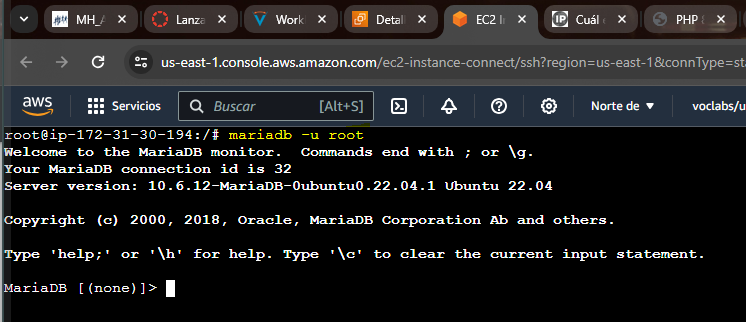

# ACTICIDAD 1.3.1: Instalación de la pila LAMP (Linux, apache, MariaDB y PHP) en una instancia EC2 de AWS con Debian/Ubuntu Server:

## Instalación de PHP:

#### Actualizamos repositorios:

#### Instalamos Apache2:

#### Instalamos el PHP:

#### Editamos el sitio web por defecto (000-default.conf):

#### Reiniciamos el servicio apache2:

#### Comprobación de LAMP stack:

## Instalación de MariaDB

####

####

####

####

## Instalación phpmyadmin:

