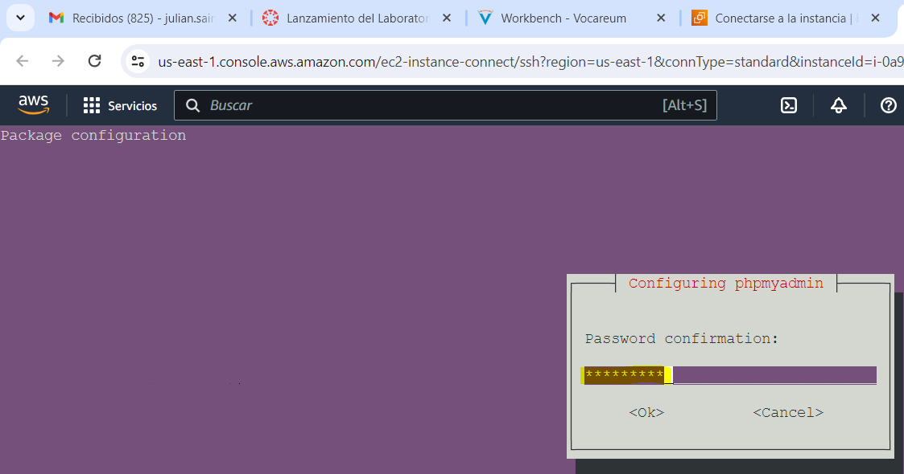

# ACTICIDAD 1.3.1: Instalación de la pila LAMP (Linux, apache, MariaDB y PHP) en una instancia EC2 de AWS con Debian/Ubuntu Server:

## Instalación de PHP:

#### Actualizamos repositorios:

#### Instalamos Apache2:

#### Instalamos el PHP:

#### Editamos el sitio web por defecto (000-default.conf):

#### Reiniciamos el servicio apache2:

#### Comprobación de LAMP stack:

## Instalación de MariaDB
#### Actualizamos los repositorios:

#### Instalamos el servidor de base de datos y cliente:

#### Acceso a MariaDB desde la consola servidor:

#### Cambiar la contraseña de root: 

## Instalación phpmyadmin:
#### Para llevar a cabo la instalación del PHPmyAdmin, tendríamos que poner lo siguiente:

#### Durante el proceso de instalación no debemos de olvidarnos de elegir el servidor web apache2:

#### Debemos de confirmar que queremos utilizar dbconfig-common: 

#### Finalmente nos pedirá una contraseña para phpmyadmin:

#### Nos pedirá que volvamos a confirmar la contraseña para ver si coinciden ambas:

#### Nos pedirá también el método de acceso al phpmyadmin, en el que seleccionaremos mediante TCP/IP:

#### Le indicaremos un nombre a la base de datos de phpmyadmin:

#### Después un usuario para el phpmyadmin:

#### Nos pedirá una contraseña:

#### Y la confirmación de dicha contraseña:

#### Después le indicaremos el nombre del usuario administrador de la base de datos, que en mí caso le he dicho que se llama root:

#### Nos pedirá una contraseña para dicho usuario:

#### Y finalmente nos conectamos mediante la IP pblica a nuestro phpmyadmin con el usuario creado anteriormente:

