## Instalación de WordPress en una instancia EC2 de AWS

#### Instalación de otros paquetes php necesarios:
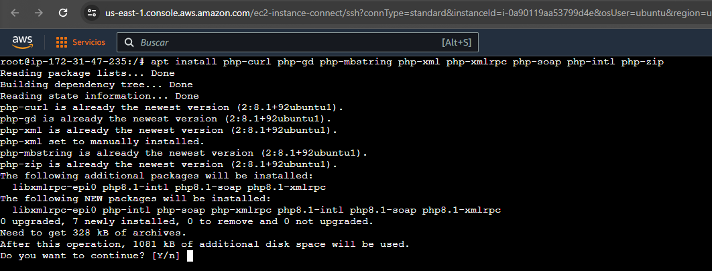
#### Creación y configuración de la base de datos:
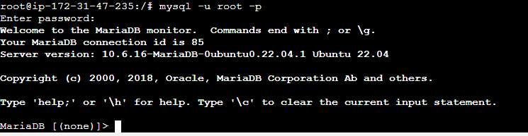
####
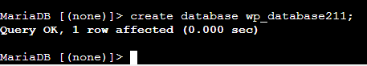
####
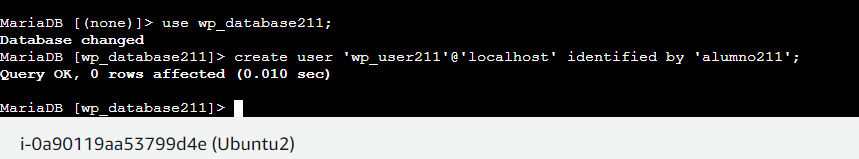
####
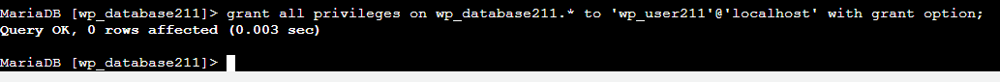
####
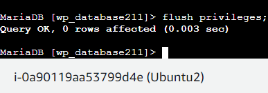
####
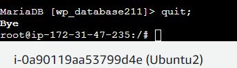
#### Configuración APACHE2: Utilizaremos el sitio por defecto: 000-default.conf 
#### Ese sitio habrá que editarlo y añadiremos las siguientes directivas:
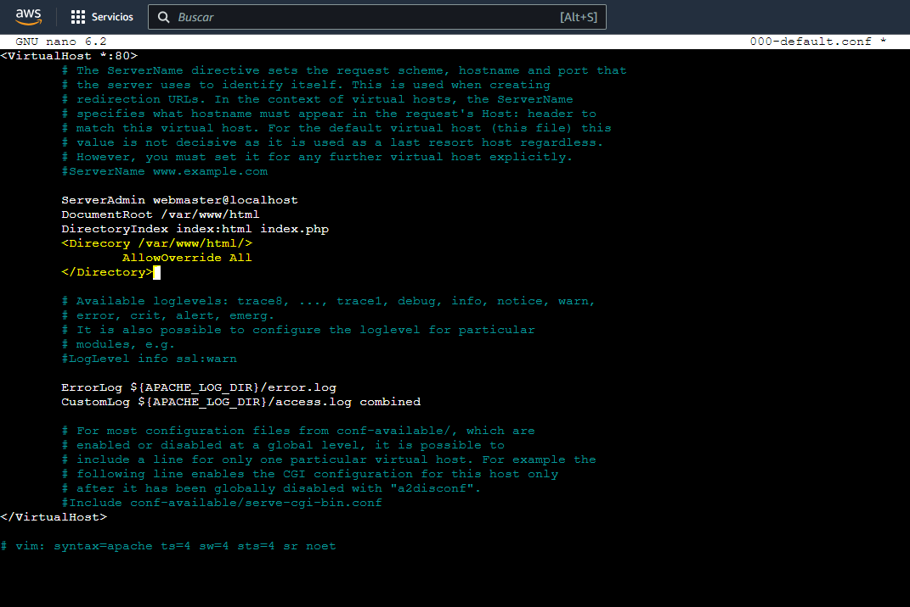
#### Ahora, se activa el mod_rewrite para utilizar la función de permalink o enlace permanente de WordPress:

#### Una vez realizado lo anterior, ahora tocaría descargar e instalar el WORDPRESS:
#### Instalamos el paquete wget, que será más útil para descargar los archivos de Wordpress:
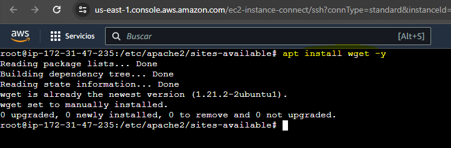
#### A continuación, utilizamos el comando wget seguido del enlace de descarga de WordPress:
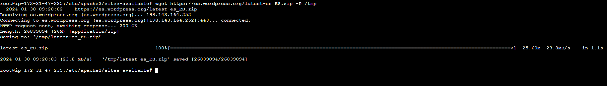
#### Una vez que hayamos descargado el archivo comprimido, instalamos la utilidad de descompresión unzip:
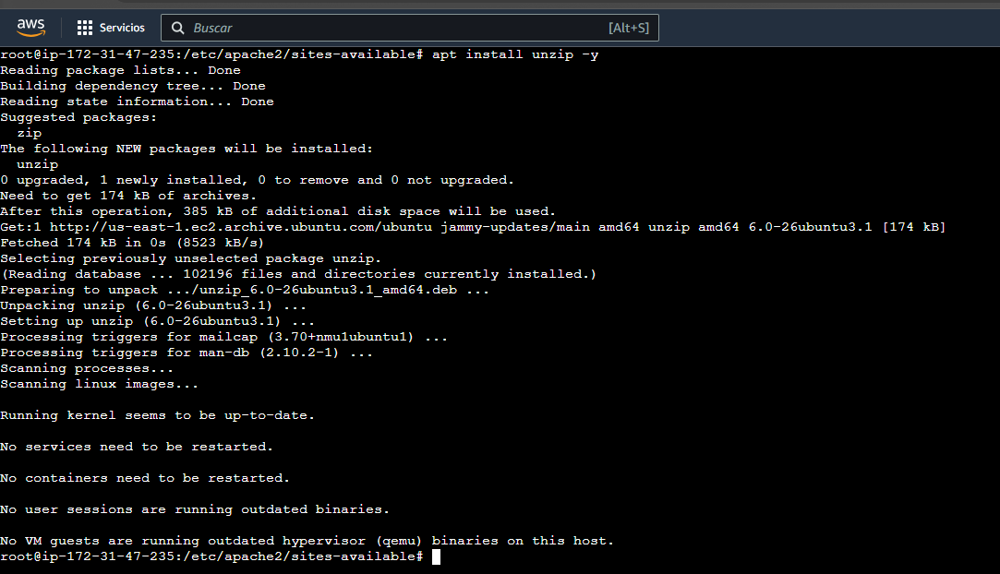
#### Y lo descomprimimos con el siguiente comando:
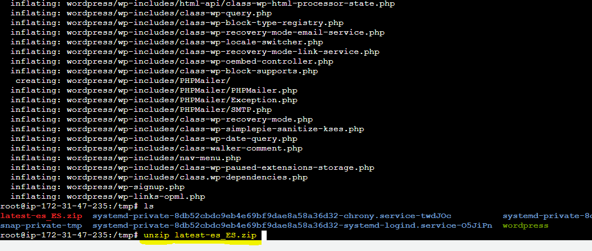
#### El contenido se ha descomprimido en una carpeta que se llama wordpress. Ahora, movemos el contenido de /tpm/wordpress a /var/www/html:
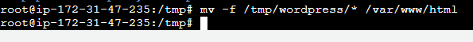
#### Cambio el usuario propietario de documentRoot:
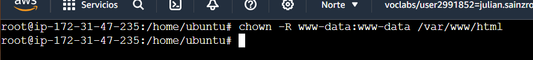
#### Reiniciamos el servicio Apache2:
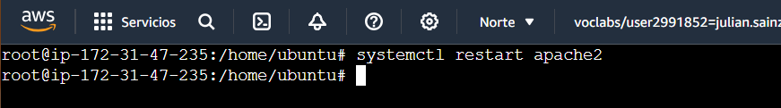
#### Terminamos de configurar WordPress a través de un navegador web. Abrimos un navegador web y escribimos la dirección IP del servidor:
#### Una vez que hayamos iniciado la sesión, accederemos al panel de administración de Wordpress. Ahora podemos empezar a personalizar el sitio web instalando plugins y temas de WordPress:
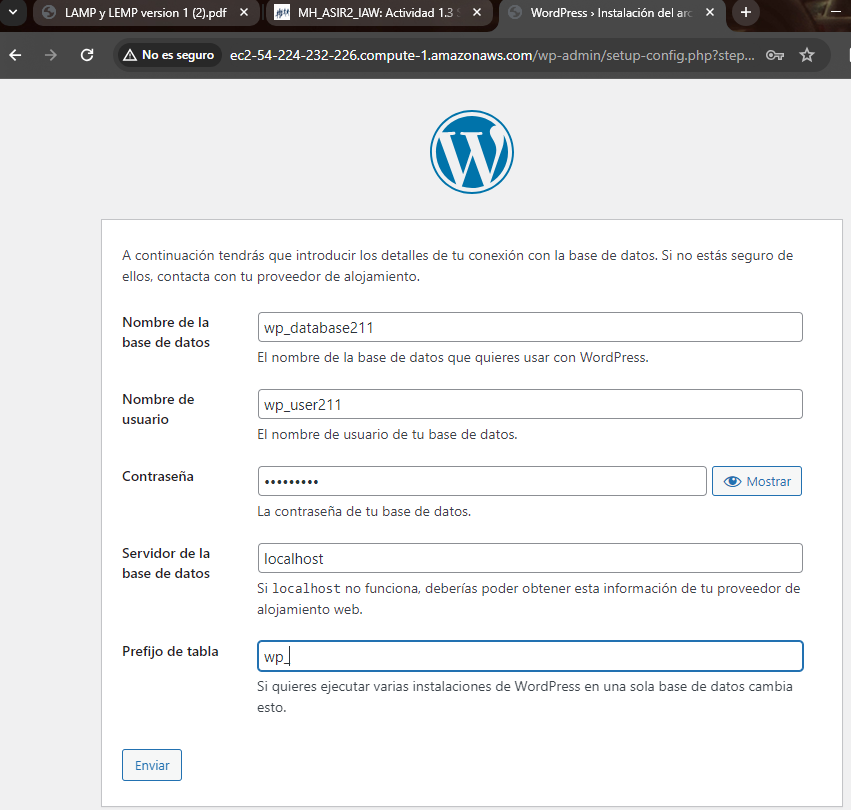
#### Una vez conectado nos datá la bienvenida:
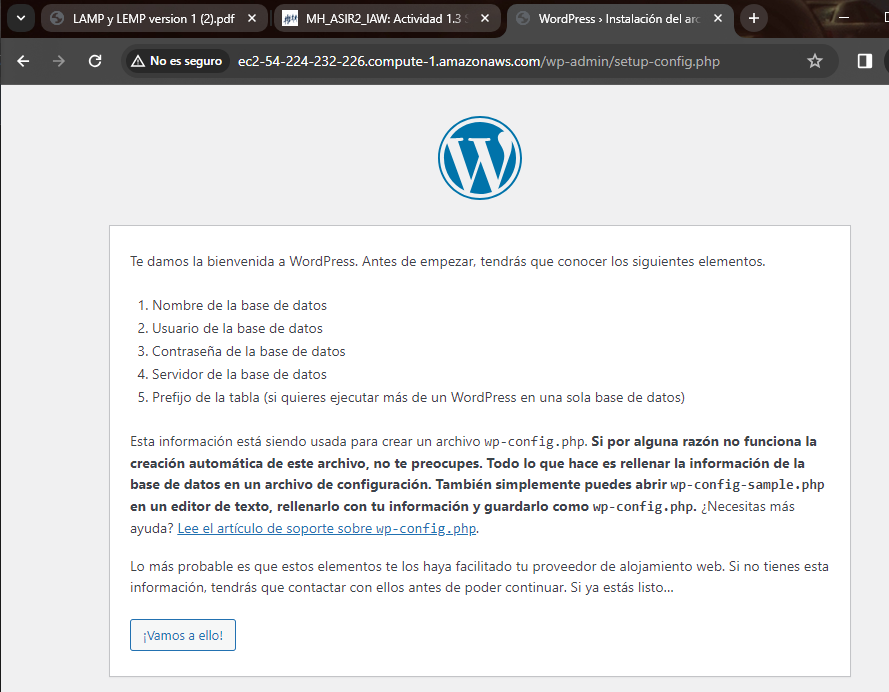
#### Después tendremos que proporcionar cierto tipo de información, como puede ser el título del sitio, el nombre del usuario, la contraseña, etc...
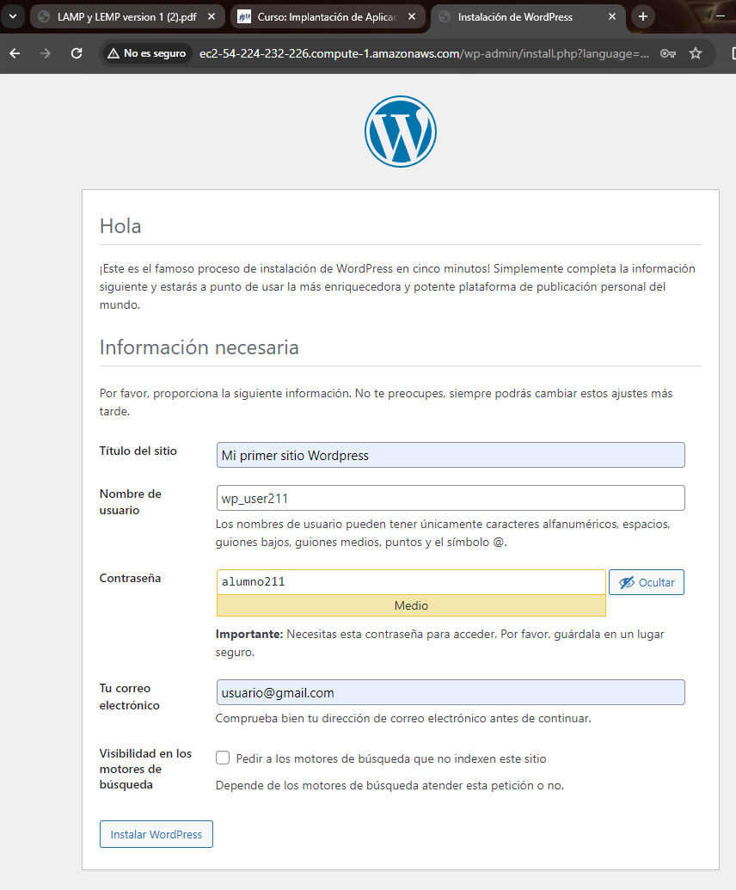
#### Una vez proporcionada esa información, nos aparecerá una mensaje en el que nos dice que lo logramos:
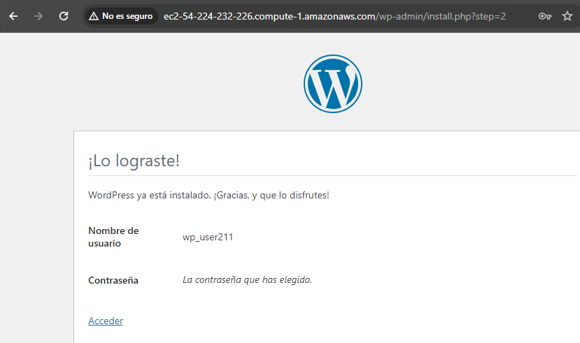
#### Y seguido accederemos con nuestro usuario creado anteriormente y también la contraseña:
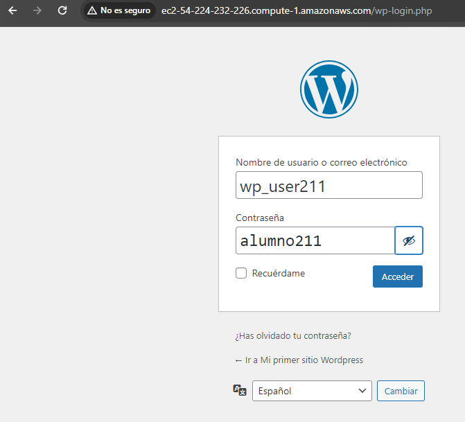

