## Instalación de WordPress usando contenedores Docker y Docker Compose

#### Lo primero es desinstalar los paquetes que pueden entrar en conflicto
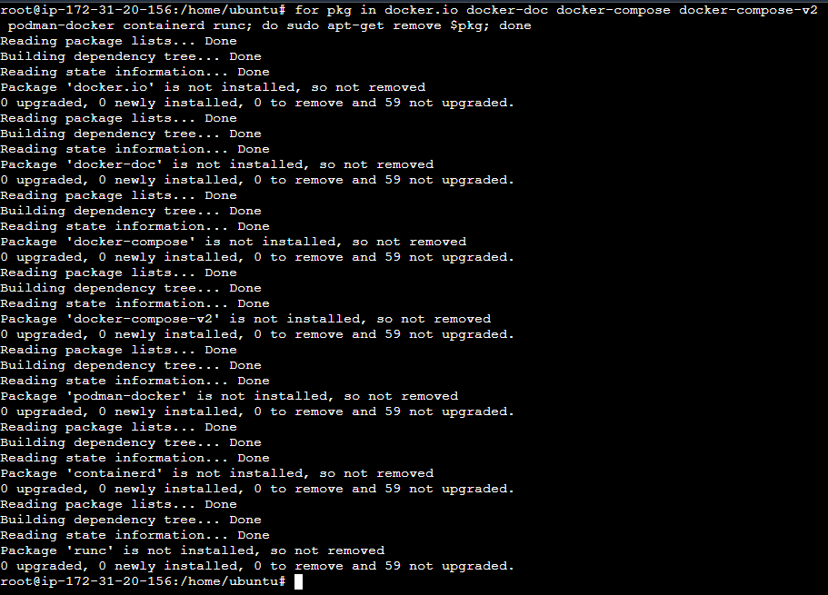
#### Después ejecutamos los siguientes comandos:
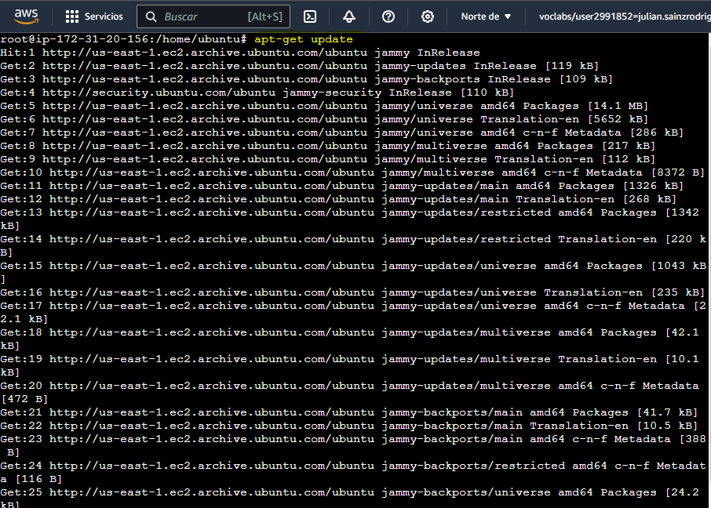
#### Instalamos los certificados:
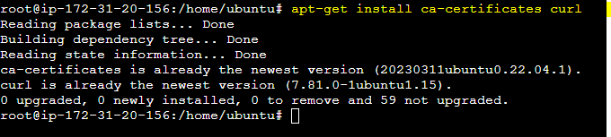
#### Lo instalamos:
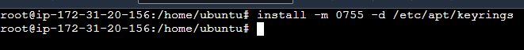
#### Lo descargamos de Internet:
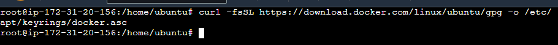
#### Le damos permisos:
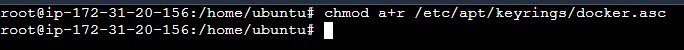
#### Ejecutamos lo siguiente:
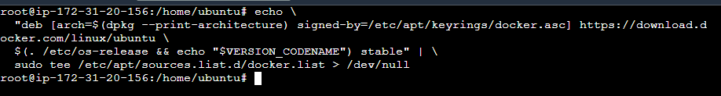
#### Actualizamos:
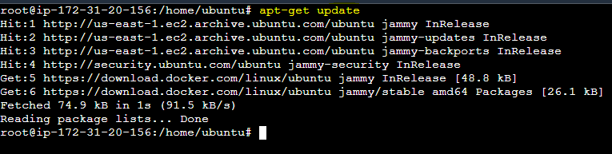
#### Una vez realizado lo anterior, instalamos el motor de Docker:
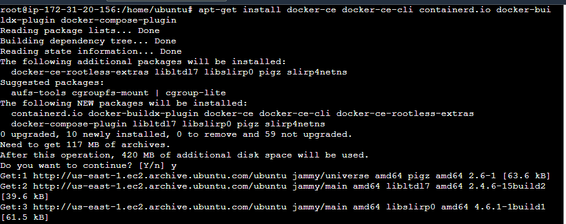
#### Para ver la version del docker ejecutamos lo siguiente: 
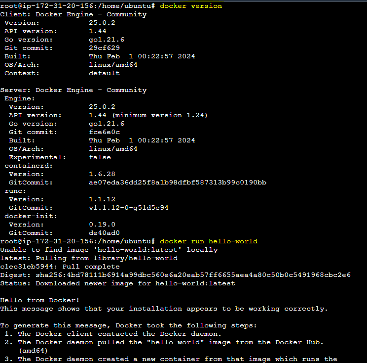
#### Para ver la version del docker compose ejecutamos lo siguiente: 
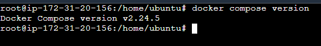
#### Con el comando cat /etc/group podemos ver la gestión de docker como usuario:
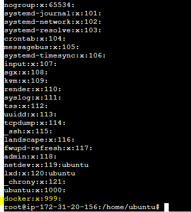
#### Seguimos con la gestión del docker:
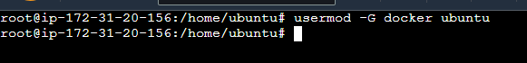
####
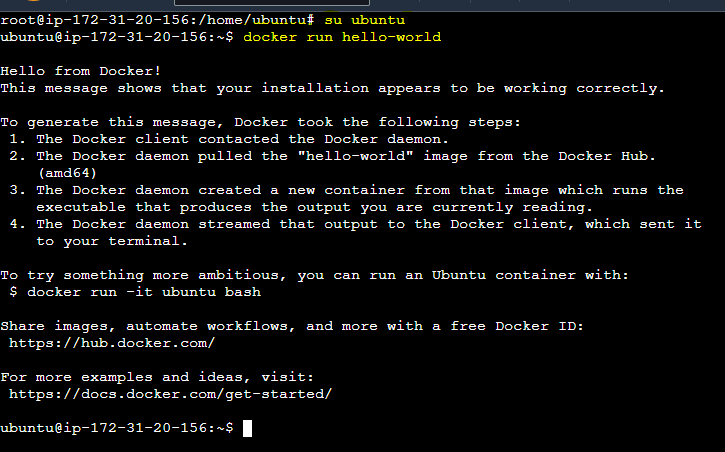
#### Instalamos el git, para posteriormente clonarnos nuestro repositorio:
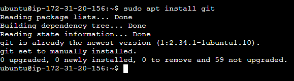
#### Clonamos el repositorio:
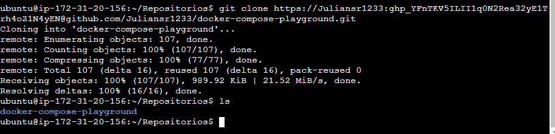
#### Con el siguiente comando ejecutamos el docker-compose.yml dentro del repositorio:
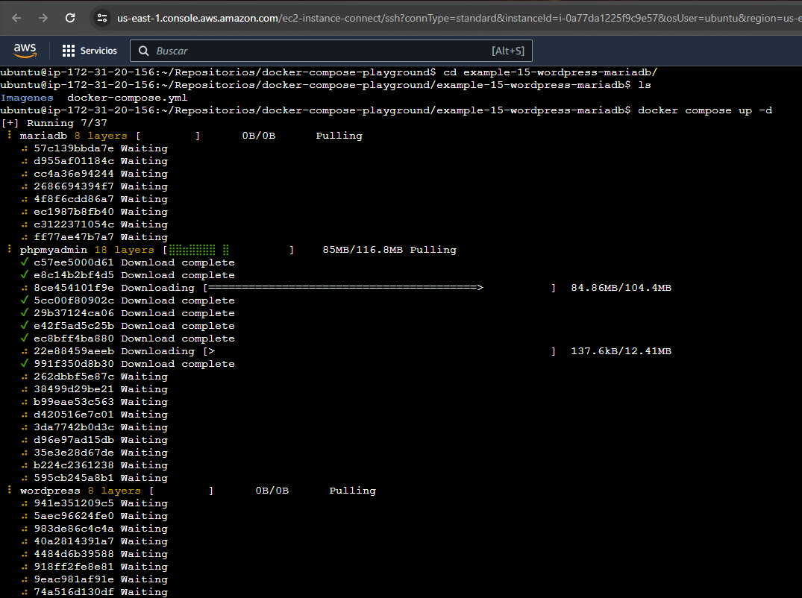
#### Accedemos al WordPress y creamos nuestro segundo sitio:
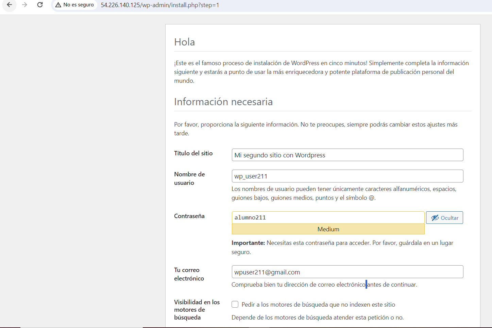
#### Nos conectaremos con nuestro usuario creado anteriormente:
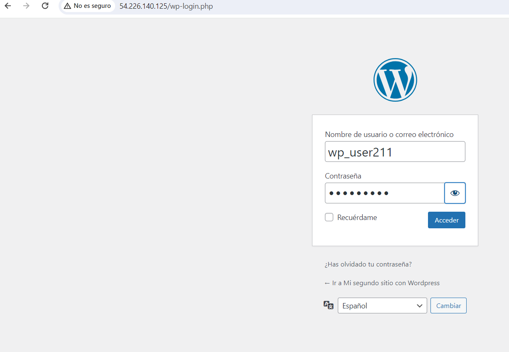
#### Mostramos lo que habíamos creado de nuestro docker-compose.yml:
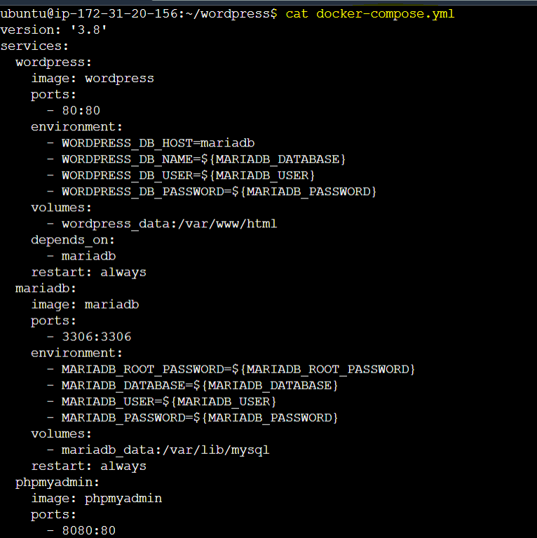
####
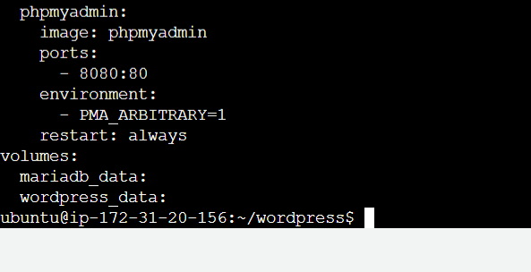
#### Editamos algunos de los ajustes generales en el WordPress:
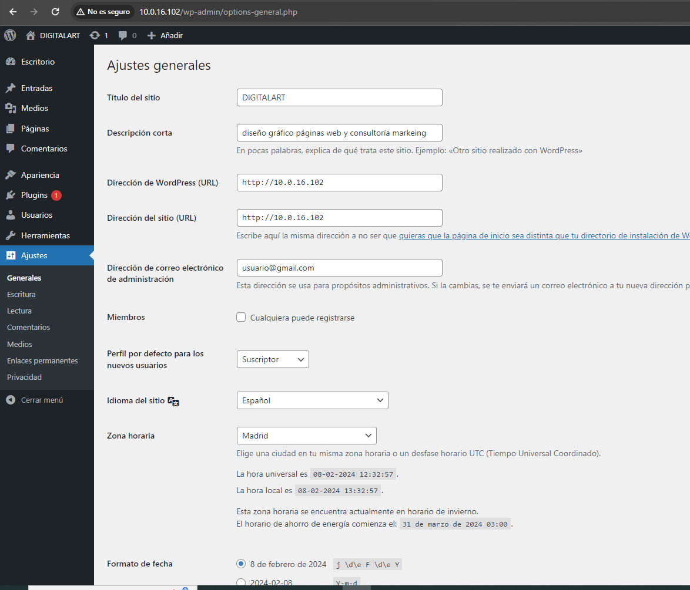
#### Y finalmente, de la siguiente manera podemos crear las nuevas entradas:
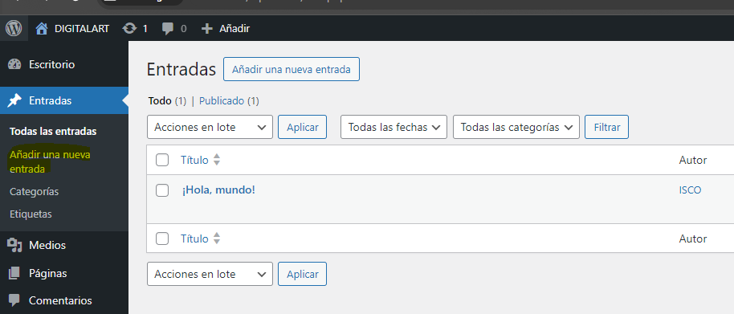