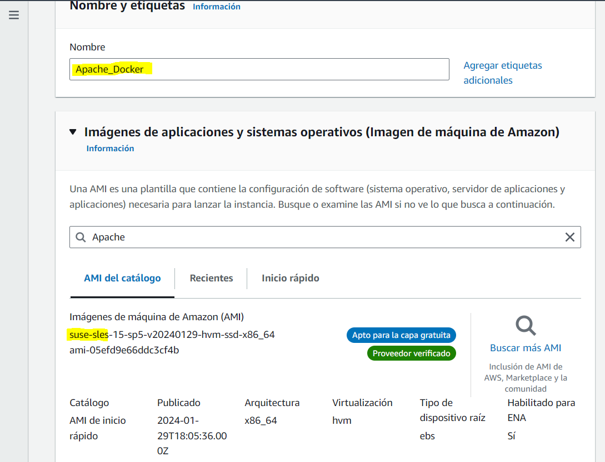
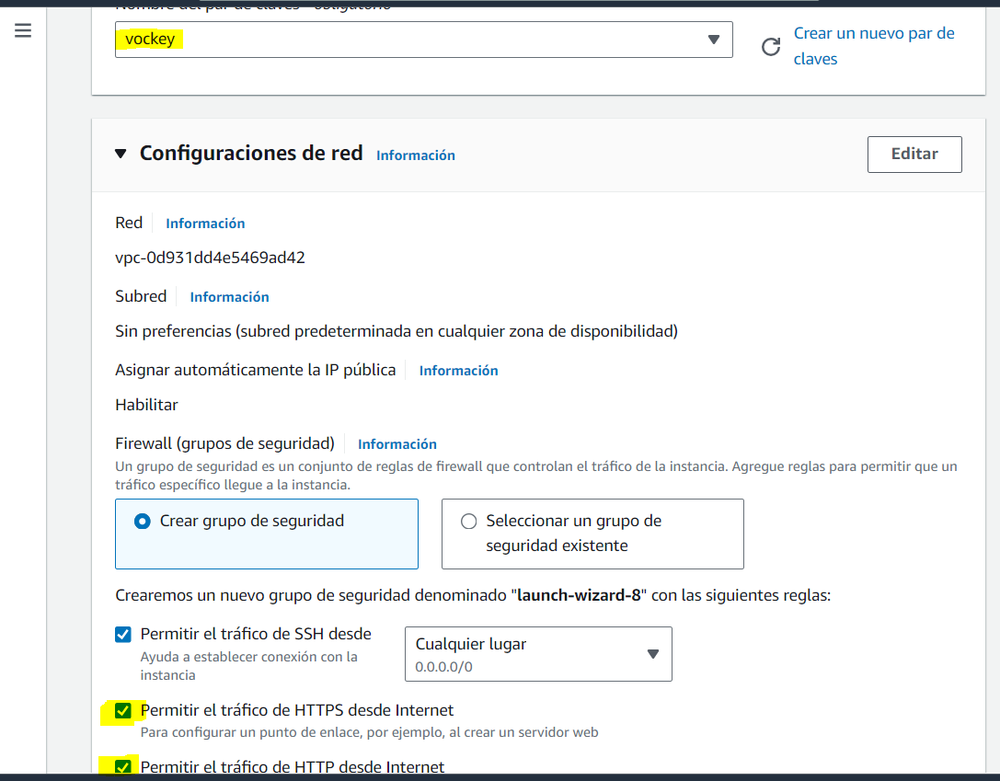
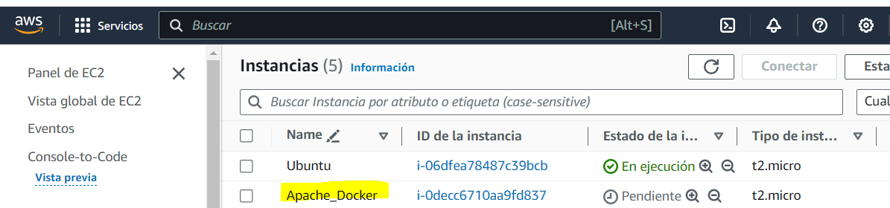

## Creación de un entorno de desarrollo LAMP con una pequeña aplicación WEB
#### No he logrado conseguir hacer ningún apartado de lo que nos pides en esta parte, así que te muestro al menos los pasos de instalación de la máquina Apache:

#### Seleccionamos en las características el vockey y que permitimos el tráfico de HTPS y HTP desde Internet:

#### Finalmente, en las instancias podemos ver que se creó correctamente nuestra máquina:

