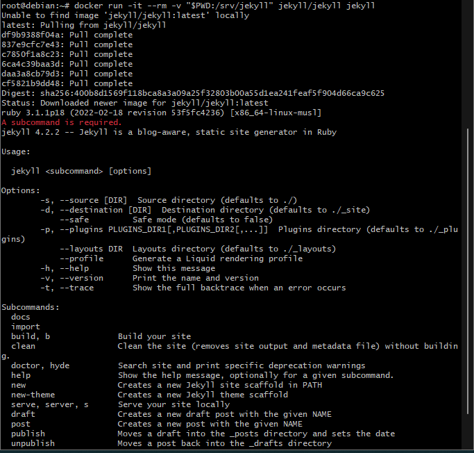
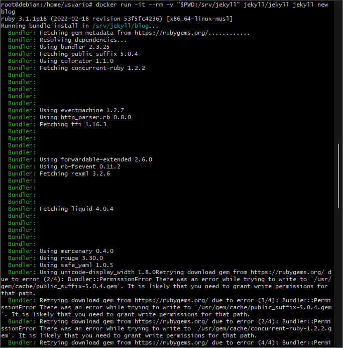
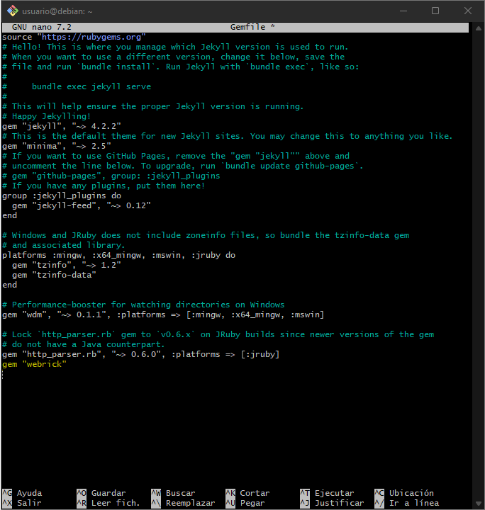
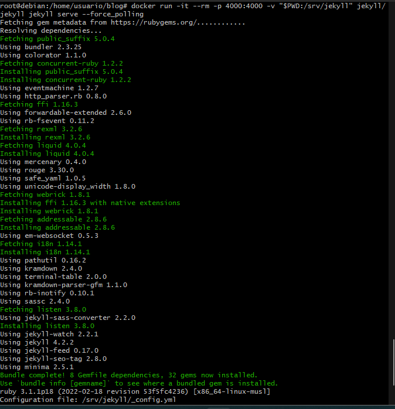
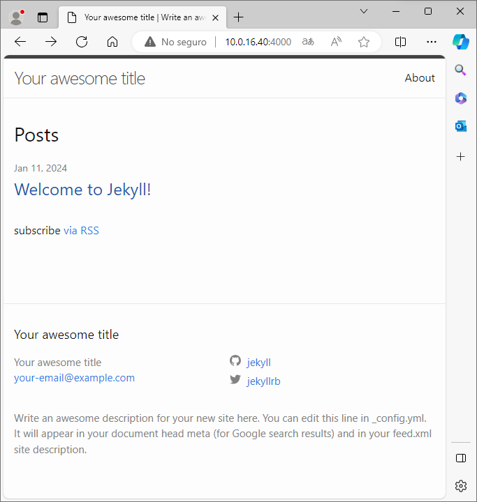

# Sitio Local en Jekyll con Docker

```
Antes de empezar a modificar las cosas, para poder usar los comandos de este documento deberemos de estar con el usuario: root.
```

## Creamos un contenedor Docker con Jekyll:

```
El comando que necesitamos para crear el contenedor es:
docker run -it --rm -v "$PWD:/srv/jekyll" jekyll/jekyll jekyll
```



## Creamos la estructura de directorios y los archivos necesarios para un proyecto Jekyll nuevo:

Antes de usar este comando debemos estar en /home/usuario:

```
El comando necesario para la creación de la estructura de directorios es:
docker run -it --rm -v "$PWD:/srv/jekyll" jekyll/jekyll jekyll new blog
```



## Modificamos el archivo gemfile, el la parte de abajo añadimos gem "webrick"
```
Es muy probable que de error al iniciar el servidor, y para prevenir ese error, añadimos la línea de la gema de la siguiente manera:
```



## Con este comando nos permite servir de forma local un sitio HTML estatico generado a partir del proyecto:

```
El comando necesario para servir de forma local es el siguiente:
docker run -it --rm -p 4000:4000 -v "$PWD:/srv/jekyll" jekyll/jekyll jekyll serve --force_polling
```


## Comprobamos desde nuestro 




