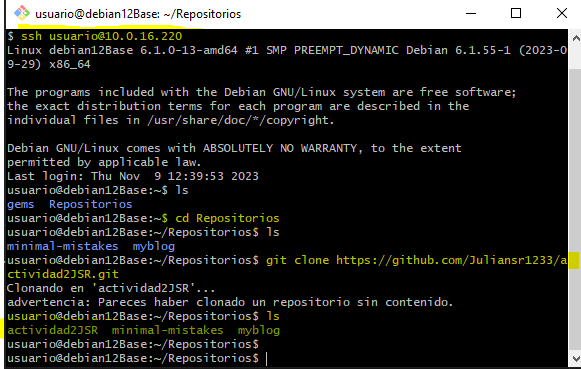
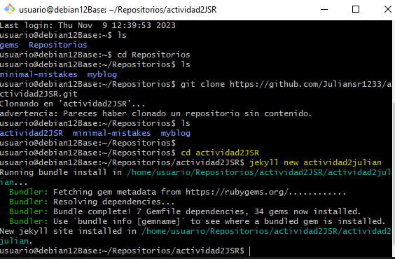
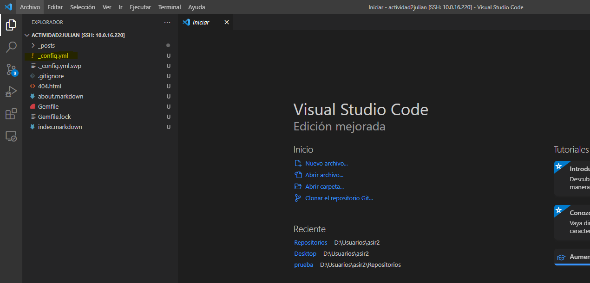
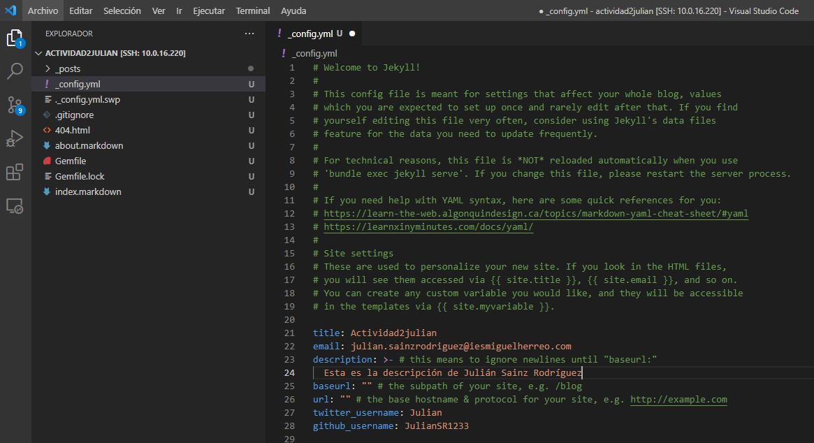
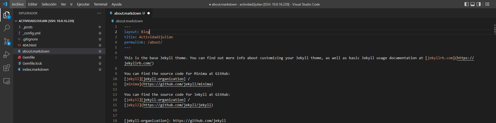
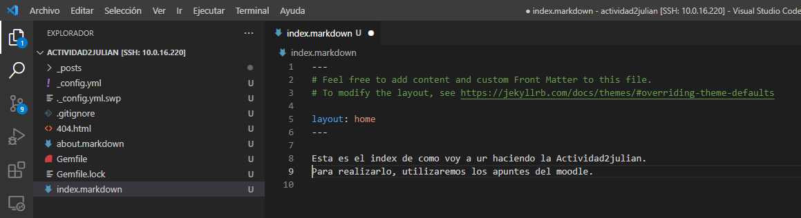
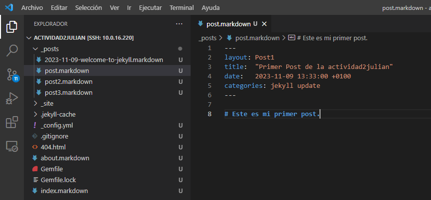
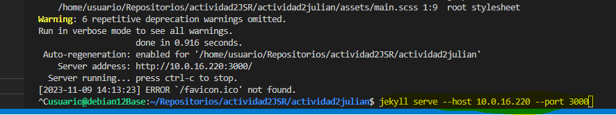
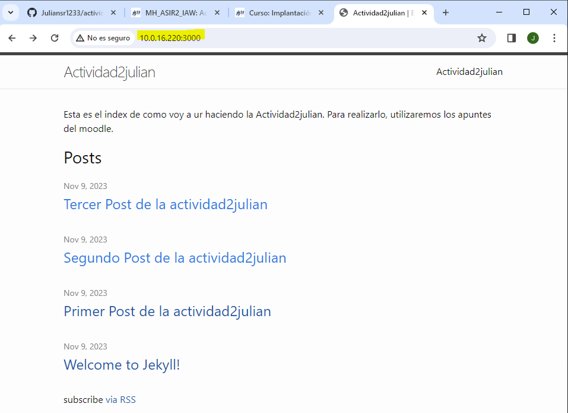

# Práctica 2 Julián Sainz Rodríguez Jekyll

## Índice:
[Primer paso](#paso-1)  
[Segundo paso](#paso-2)  
[Tercer paso](#paso-3)  
[Cuarto paso](#paso-4)  
[Quinto paso](#paso-5)  
[Sexto paso](#paso-6)  
[Séptimo paso](#paso-7)  
[Octavo paso](#paso-8)  
[Noveno paso](#paso-9)  
## Paso 1: 
Lo primero que hice fue conectarme desde el Git Bash al Debian, escribiendo un ssh el nombre del usuario seguido de un '@' y la ip de nuestro servidor Debian.  
Una vez que conseguimos acceder, entramos en la caprpeta de Repositorios, y hacemos un git clone, para tenerlo también desde local. Una vez que lo clonamos, hacemos un ls para ver que lo hemos hecho bien.

## Paso 2:
Entramos ahora en la actividad2JSR y hacemos un nuevo jekyll con el siguiente comando:

## Paso 3:
Una vez que lo tenemos, accedemos desde el visual studio code a nuestro servidor de Debian, para ello debemos de pulsar F1 y pulsamos en conectar a host. Esperamos a que se conecte, y una vez dentro empezamos a modificarlo:

## Paso 4:
Lo primero que debemos de modificar es el config.yml, en mí caso le cambié el título, el email, le pue una descripción (Para que se vea la descripción, debemos de ponerle un tabulador), también le añadimos un usuario de Twitter y un usuario de Git Hub: 

## Paso 5:
Seguido a la modificación del config.yml, modificamos el about, en el que le cambiaremos el layout y el título:

## Paso 6:
Después, modificamos el index simplemente poniendo un texto, que en mi caso va a ser el siguiente:

## Paso 7:
Las últimas modificaciones serían añadir los nuevos post. Para ello pongo el primer ejemplo del primer post, ya que los otros dos los he creado de la misma manera. Cambiamos el layout, el título, la fecha y le añado un texto:

## Paso 8:
Finalmente, con el comando que se muestra en la captura abriríamos el puerto para poder acceder a la página. También se podría hacer con el siguiente comando: bundle exec jekyll serve --host "la ip" --port "el puerto".

## Paso 9:
Comprobamos que con la Ip seguido de dos puntos y el puerto, podemos acceder a lo creado:

